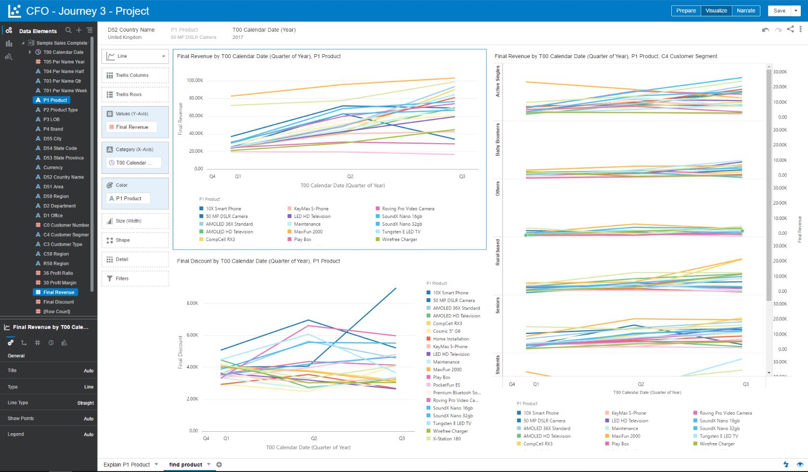
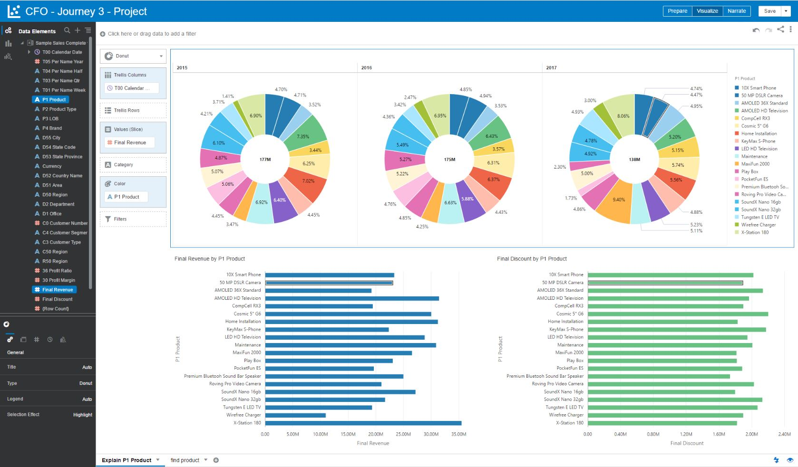
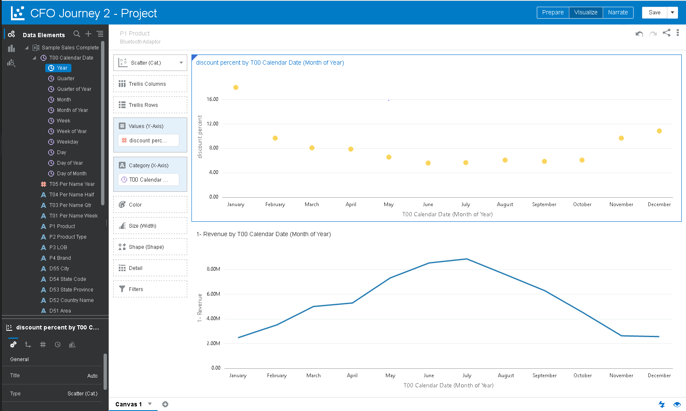

# XYZCorp Data
data & data generator for TODO: what is it for?

Mr Roy is the Finance SVP of XYZ Corp. They currently have 5 Data Centers all across EMEA.

### SVP Finance
Mr Roy receives a notification from his Day by Day Mobile App (bring back feature of the app). He clicks on that which takes him to the app’s dashboard. He observes that there a steep decline in revenue in UK for one 
particular product in Q3 of 2017. He then sends out an email to the UK Regional Sales Manager to investigate further in this matter.

### UK Regional Manager
The Regional Manager digs deeper into this issue using DV. He discovers that due to a recent Ad Campaign that XYZ Corp launched, the company gave out a huge discounts for a 7 MegaPixel Digital Camera. 
He then recommends his Financial Analyst to come up with a plan to increase the revenue for this product in UK.

### Financial Analyst
The Fin Analyst uses Essbase to create three WhatIf Scenarios.
1st WhatIf: He creates a scenario to observe the revenue trend for the next 2 quarters before making any changes and discovers that if the same trend continues, the UK revenue would take a huge hit
2nd WhatIf: He decreases Discounts by one thirds for 50 MegaPixel Digital Camera and observes that this has a positive impact on revenue
3rd WhatIf: He creates a scenario for currency conversion for Revenue from EURO to USD for reporting purposes. He submits the above scenarios for approval to his manager.

### UK Regional Manager
The Manager approves the three scenarios. He then uses the modified data and adds filters, includes the “Explain” capability for attributes and performs some advanced analytics to observe the changes to revenue 
in the already built visualizations in DV. He also performs a few drill downs to explain the results in an additional canvas. He adds this story to the narrate section and saves the file.

## Data Creation Task
The Dataset currently has data till 2017 Q3. I would like some data atleast till 2017 Q4 (if possible 2018 Q1) to do a forecast. We modified Final Revenue and Final Discount values (as named in the dataset) to half and twice their original values respectively for 50MP Digital Camera product in the UK (EMEA) region (as indicated in the above story). I would like a similar pattern with the newly created 2017 Q4 data. 
